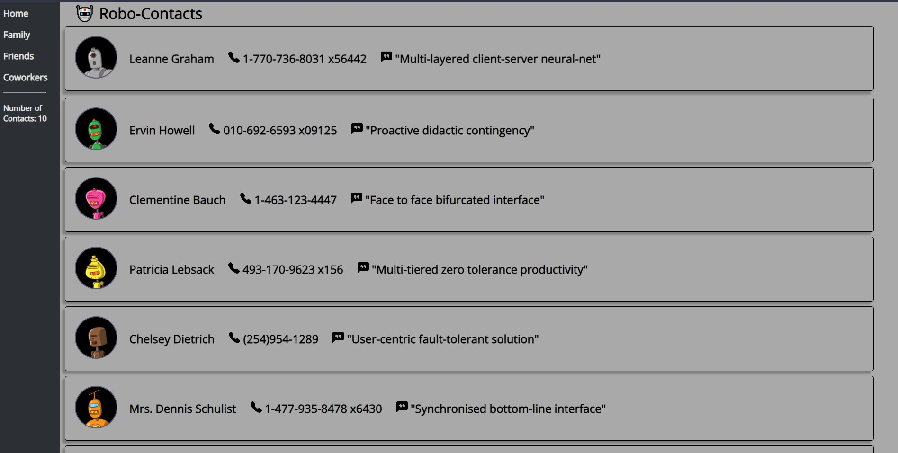

# Robot Contacts List Using API Fetch and Hooks

- this project taught me me how to fetch from two APIs, use hooks, and style with CSS
- robot icons provided by [RoboHash](https://robohash.org/)

[Random Robot Contacts](https://silly-mirzakhani-f1dd51.netlify.app/)
